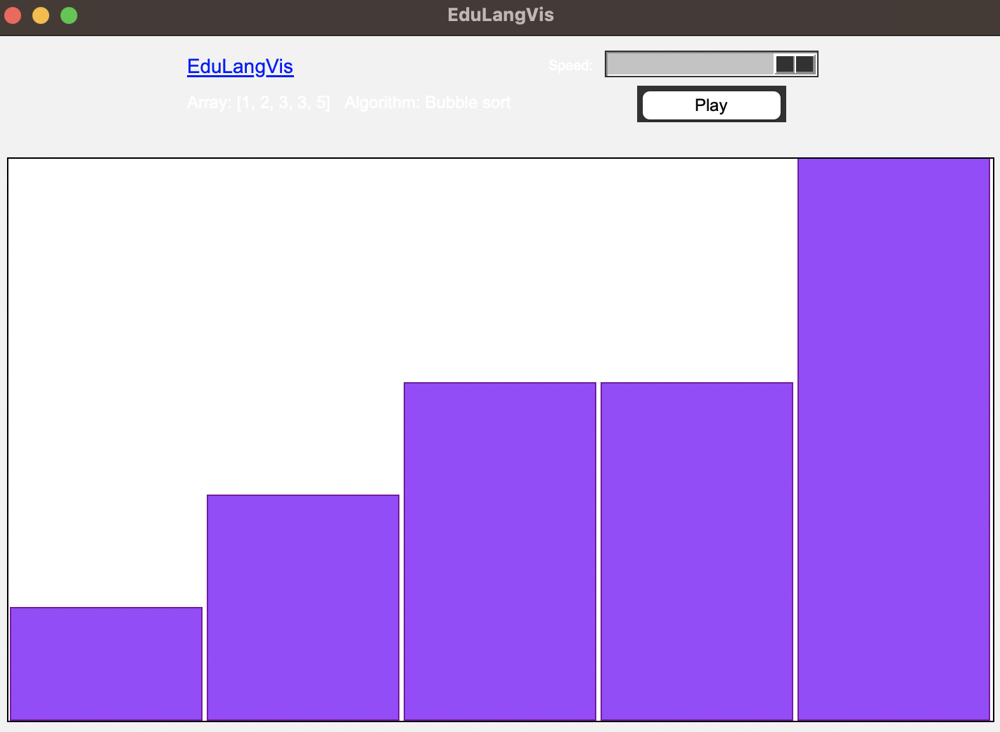

# EduLangVis

**An educational compiler with sorting algorithm visualization**

**Authors:**
- **Carlos Gongora - 20221020049**
- **Sebastian Castellanos - 20202020044**

_This is a project for the Computer Science 3 course at the Francisco José de Caldas District University. By Eng. Carlos Andrés Sierra in 2025-1._
## Desciption

EduLangVis is a Python application that implements a compiler for an educational language. Once compiled correctly, it graphically displays the process of sorting an array using algorithms such as **Bubble Sort**, **Merge Sort** and **Quick Sort**.

The steps are:

1. **Lexical Analysis:** Tokenize source code
2. **Syntax Analysis:** Verify the grammar and generate an internal structure
3. **Semantic Analysis:** Check rules and restrictions
4. **Visualization:** Generate and animate the steps of the sorting algorithm used, using Tkinter

## Characteristics

- Simple lenguage with three simple instructions "ARRAY", "ALGORITHM", "VISUALIZE".
- Support for three diferent sort algortithms:
  - `bubble_sort`
  - `merge_sort`
  - `quick_sort`
- Console interface
- Interactive Visualization

## Download
Download from the repository:
```bash
   git clone https://github.com/tu-usuario/EduLangVis.git
   cd EduLangVis
```
Install dependencies:
```bash
   pip install -r requirements.txt
```
## Usage

1. Launch program:

```bash
   python main.py
```


2. Write your code using EduLangVis on the main console:

```bash
ARRAY "[array]"
ALGORITHM "sort_algorithm_name"
VISUALIZE
```



3. Press Compilate and Visualize button
   - If have errors, the console will throw you exceptions.
   - If have success, your gonna see a control window to see the sorting process.
## Example
```plaintext
ARRAY [6, 5, 4, 2, 1, 3]
ALGORITHM bubble_sort
VISUALIZE
```
Press __**Compilate and Visualize**__ if the compilation was success, it throw a message
```plaintext
Success Compilation, Ready to visualize
```
The display window will open with bars that are sorted step by step.
## Token Specification


- "ALGORITHM_NAME", 
   - r"\b(?:bubble_sort|merge_sort|quick_sort)\b"
- "KEYWORD"
   - r"\b(?:ARRAY|ALGORITHM|VISUALIZE)\b"
- LBRACKET"      
   - r"\["
- "RBRACKET"      
   - r"\]"
- "COMMA"        
   - r","
- "NUMBER"       
   - r"\d+"
- "NEWLINE"       
   - r"\n"
- "SKIP"        
   - r"[ \t]+"
- "MISMATCH"      
   - r"."
## Grammar
``` plaintext
<SCRIPT>        -> ARRAY <ARRAY_LITERAL> ALGORITHM <ALGORITHM_NAME> VISUALIZE
<ARRAY_LITERAL> -> LBRACKET <NUMBER_LIST> RBRACKET
<NUMBER_LIST>   -> NUMBER ( COMMA NUMBER )*
```
